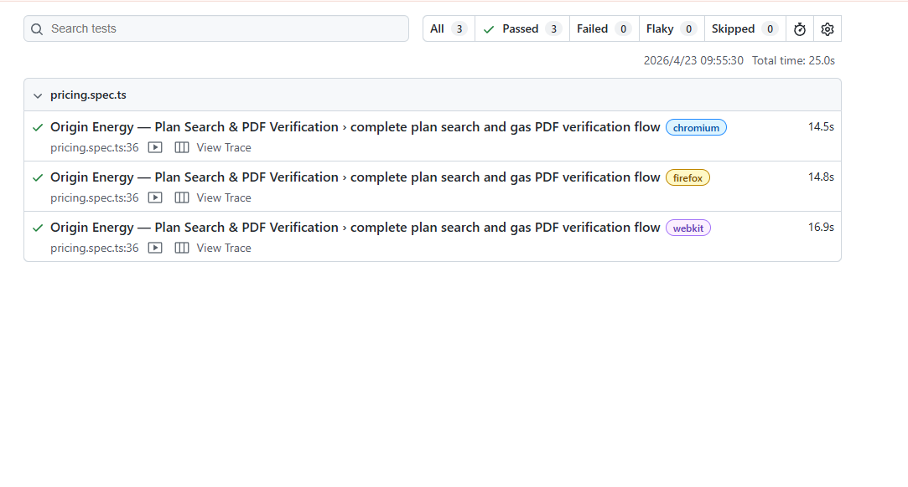

# Origin Energy — Playwright Automation

Automated end-to-end test for the Origin Energy website plan search flow, built with Playwright + TypeScript using the Page Object Model (POM) pattern.

---

## What is tested

| # | Step |
|---|------|
| 1 | Navigate to `https://www.originenergy.com.au/pricing.html` |
| 2 | Search for address `17 Bolinda Road, Balwyn North, VIC 3104` |
| 3 | Select the address from the dropdown |
| 4 | Verify the plans list is displayed |
| 5 | Uncheck the Electricity checkbox |
| 6 | Verify plans are still displayed after filtering |
| 7 | Click the plan link in the Plan BPID/EFS column |
| 8 | Verify the PDF opens in a new tab |
| 9 | Download the plan PDF to the local file system |
| 10 | Assert the PDF content confirms it is a Gas plan |

---

## Project layout

```
.
├── pages/
│   ├── BasePage.ts         # Shared: navigation, popup close
│   └── PricingPage.ts      # Address search, filters, plan selection
├── tests/e2e/
│   └── pricing.spec.ts     # Single test suite (10 steps above)
├── utils/
│   └── pdfUtils.ts         # PDF text extraction + Gas plan detection
├── playwright.config.ts   # Reporters, timeouts, browser matrix
├── Dockerfile              # Multi-stage build, Playwright + pdf-parse
├── docker-compose.yml      # Local Docker run
├── .github/workflows/      # GitHub Actions CI
└── package.json           # npm scripts
```

---

## Local setup

```bash
npm install
npx playwright install --with-deps chromium firefox webkit

# Run tests (headless, all browsers)
npm test

# Open HTML report
npm run report
```

---

## Docker (Local)

```bash
# Build and run
docker-compose up --build

# Tear down
docker-compose down -v
```

Results are available on the host via volume mounts:
- `playwright-report/` — HTML report, JSON report, screenshots, videos, and traces
- `downloads/` — downloaded PDFs

---

## GitHub Actions CI

The project runs CI on every push and pull request to `main` and feature branches via `.github/workflows/playwright.yml`.

**CI job (`CI`):**

Runs on ubuntu with all three browsers (chromium, firefox, webkit) defined in `playwright.config.ts`.

**CI environment:**
- `CI: true` — enables retries (2x), single worker, `forbidOnly` enforcement

**Artifacts uploaded** (retained 14 days):
- `playwright-report/` — HTML + JSON report
- `downloads/` — downloaded PDFs

---

## Reports

Playwright generates three output formats automatically:

| Format | Location |
|--------|----------|
| HTML (interactive) | `playwright-report/index.html` |
| JSON | `playwright-report/results.json` |
| Console | stdout |

Screenshots (.png), videos (.webm), and traces (.zip) are stored in `playwright-report/data/` and `playwright-report/trace/` and linked from the HTML report.

---

## Test Result

